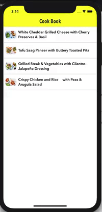

# Cook Book

## Introduction
A cooking recipe application that uses contentful api to get recipes. It has two screen. First screen has recipes list and the other one has recipes details.

## How to use it
This application is build on on **Xcode 12.0.1** using swift 5.0. Minimum deployement target is 13.1 . It's advised to use the same configurations to run the app.
Please run `pod install` after cloning the project.

## Technical Details
This project is build using the Uncle [Uncle Bob's Clean architecture](https://blog.cleancoder.com/uncle-bob/2012/08/13/the-clean-architecture.html) . Project is divided into three main layers

- Domain : It's the buisness logic of the app and it's independent of other application's modules or technologies. 
- Data : It's the database layer of the app. It contains the storage of the app as well as the RepositryInterface implementations to talk to Domain.
- UI : It's the UI part of the application. I have used MVVM-C to implement it. 

Domain is covered with Unit tests and I have written snapshot tests to test ViewModels.

## Preview

